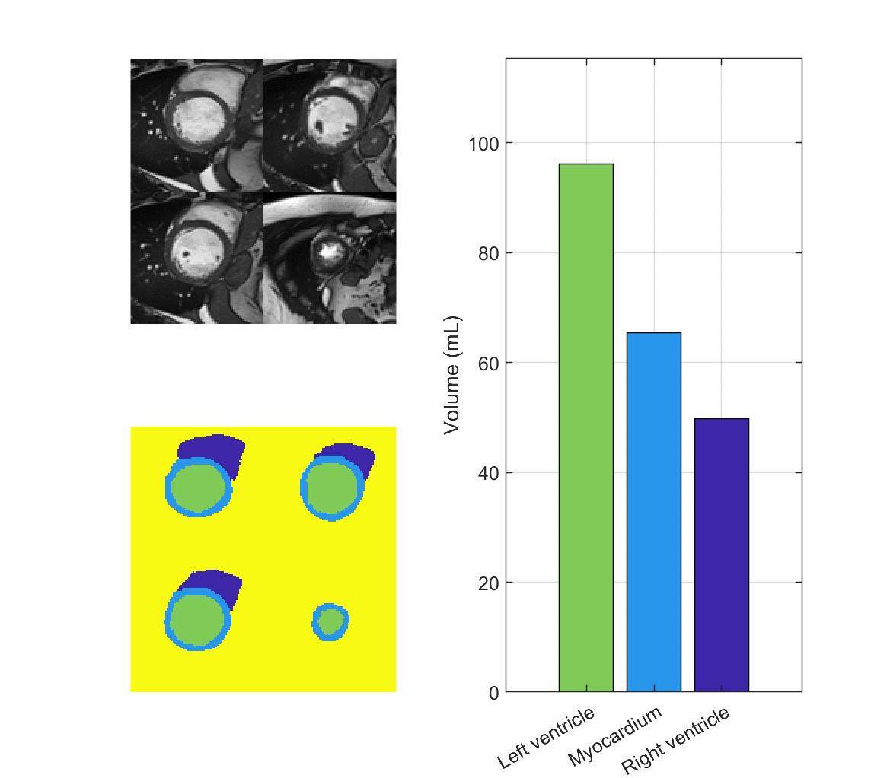

# VentricleVolume
Image-based estimation of the heart ventricular volume using deep learning and Gaussian process

In this repository, an image-based method has been developed to estimate the volume of the heart ventricles cavity using cardiac magnetic resonance (CMR) imaging data. Deep machine learning and the Gaussian process have been applied to bring the estimations closer to the values manually measured. The included example data is from ACDC challenge for disease diagnostic and segmentation of heart images ([Link](https://acdc.creatis.insa-lyon.fr/)). 

## How to use?
A 4-D array the represents short-axis slices of the heart in different time and vertical locations is required. In this repository the file is aclled 'raw.mat' with dimentions representing height, width, length (slices), and time frames, respectively; for example [226,256,10,30]. If you are using python, you can convert a numpy array into a mat file using scipy.io package. In addition, spatial resolution of the image is required to demonstrate the vocels size in x, y, and z directions with the unit of milimeter/pixel; for example [1,1,10]. Initially run the Main.py file using python 3 to above to generate 'seg.mat' which is the segmentation of the raw image. Then run Main.m using MATLAB 2020 to above, to generate an excel file named 'Result.xlsx' that contains the volumes of the left ventricle, right ventricle and myocardium in different dimentionless time frames during a complete cardiac cycle starting from end of diastole. In addition, a gif animation, like the one above will be created on your current directory named 'Final.gif'. Here is the list of python packages required to run this repository:
* numpy 
* tensorflow
* opencv-python (cv2)
* scipy
* skimage

Also, this is the list of MATLAB toolboxes required to run Main.m:
* Image processing toolbox
* Statistics toolbox

