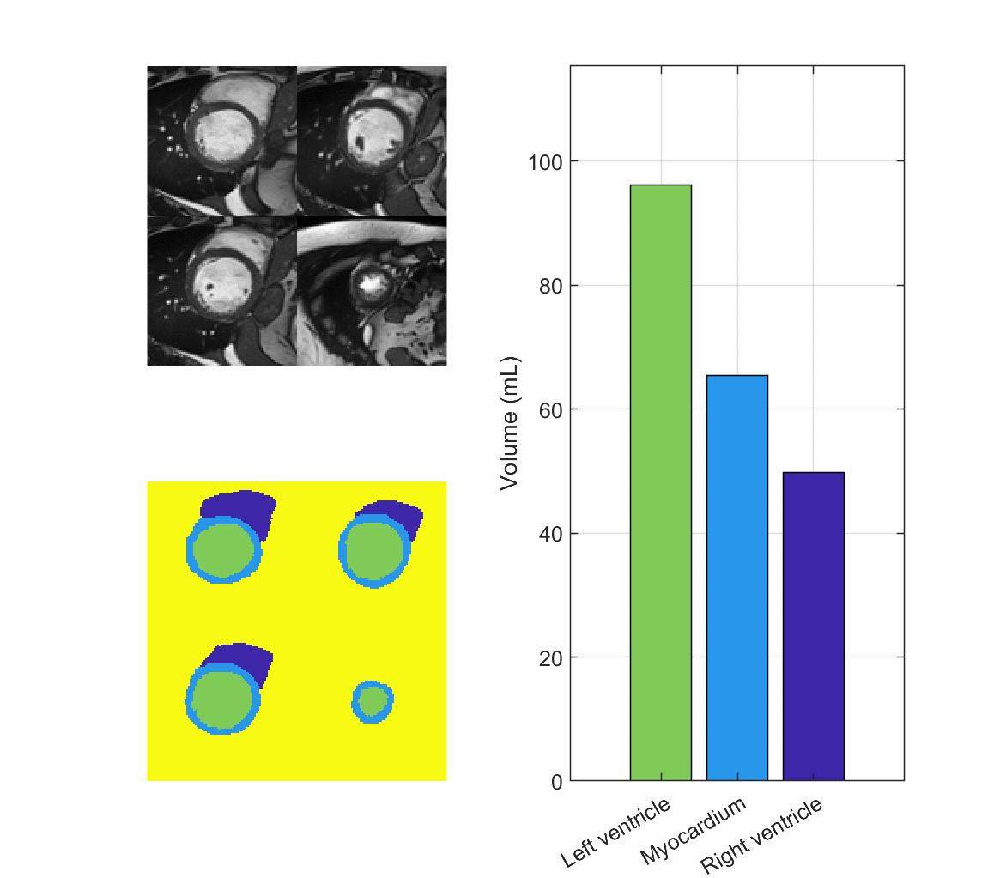
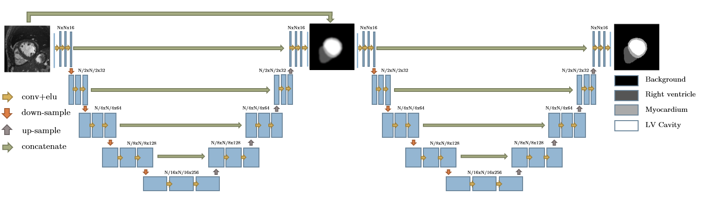
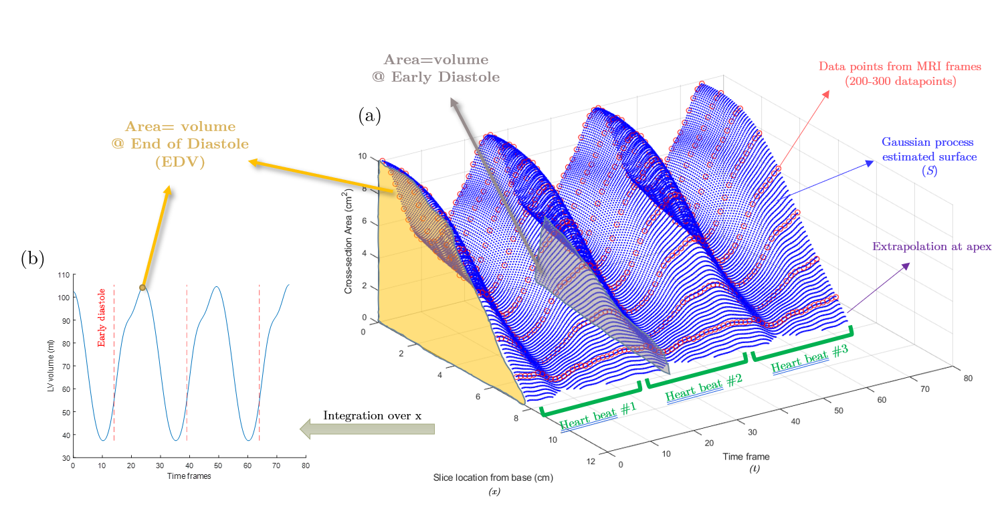
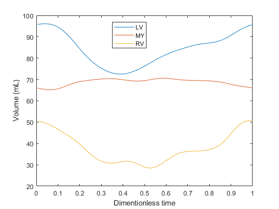

# VentricleVolume
Image-based estimation of the heart ventricular volume using deep learning and Gaussian process
 
Paper on Computerized Medical Imaging and Graphics: ([Link](https://www.sciencedirect.com/science/article/pii/S0895611123000216)).

In this repository, an image-based method has been developed to estimate the volume of the heart ventricles cavity using cardiac magnetic resonance (CMR) imaging data. Deep machine learning and the Gaussian process have been applied to bring the estimations closer to the values manually measured. The included example data is from ACDC challenge for disease diagnostic and segmentation of heart images ([Link](https://acdc.creatis.insa-lyon.fr/)). 

## How it works?
Deep learning semantic segmentation of short-axis CMR images has been performed based on a publicly available cine image dataset known as the Automated Cardiac Diagnosis Challenge (ACDC), as mentioned. The dataset has been initially published in 2017 and its training data include CMR scans of 100 patients with 5 groups of normal, myocardial infarction, dilated cardiomyopathy, hypertrophic cardiomyopathy, and dilated right ventricle.The structure of the deep learning model that we have used for segmentation is known as U-net, which is used repeatedly for similar purposes in the literature. To improve the accuracy of segmentation, we have used two U-net structures in a sequential manner as depicted in the figure below. These two trained models are stored in hdf format as 'Model1.h' and 'Model2.h'. They can be loaded into the code using keras.models.load_model() method. The output of the first U-net is stacked to the original input image to be the input for the second U-net.  

When segmented images of the left ventricle cavity are obtained, the simplest approach that can be used to estimate the volume of the cavity is counting the number of pixels and multiplying them by the physical dimensions of the pixel and the thickness of each slice in the vertical direction. Although this simplified approach has been used repeatedly in the literature, it is not the most accurate method considering the fact that it does not take into account the curved geometry of the left ventricle. To address these issues, we have used the Gaussian process (GP) package in MATLAB 2021a to fit a surface on top of all available data points that describe the cavity cross-sectional area in different time frames. The used GP kernel function is squared exponential with no standardization and a constant basis function. The fitted surface can be extrapolated towards the apex area until it intersects with the horizontal plane of zero cross-sectional area, as visible in the figure below. By integrating the area enclosed below the fitted surface (S) over the distance from the base of the heart to the apex (x), the volume of the ventricle cavity of the heart is calculated in each time frame. 

Here is an example result that shows the changes in the volume of three heart elements during a full cycle starting from end diastole. Running the code Main.m in this repository will regenerate and display this figure. 

## How to use?
A 4-D array that represents short-axis slices of the heart at different times and vertical locations is required. In this repository the file is called 'raw.mat' with dimensions representing height, width, length (slices), and time frames, respectively; for example [226,256,10,30]. If you are using python, you can convert a numpy array into a mat file using scipy.io package. In addition, the spatial resolution of the image is required to demonstrate the voxel size in x, y, and z directions with the unit of millimeter/pixel; for example [1,1,10]. An alternative to the vertical resolution (z), is to provide the vertical location of the slices one by one in a list that is called 'Meta.ZLOC' in 'Main.m' file.To begin the process, initially run the Main.py file using python 3 to above to generate 'seg.mat' which is the segmentation of the raw image. Then run Main.m using MATLAB 2020 to above, to generate an excel file named 'Result.xlsx' that contains the volumes of the left ventricle, right ventricle, and myocardium in different dimensionless time frames during a complete cardiac cycle starting from the end of diastole. In addition, a gif animation, like the one above will be created on your current directory named 'Final.gif'. Here is the list of python packages required to run this repository:
* numpy 
* tensorflow
* keras
* opencv-python (cv2)
* scipy
* skimage

Also, this is the list of MATLAB toolboxes required to run Main.m:
* Image processing toolbox
* Statistics toolbox

If you are just interested in segmentations and not the volume estimation, they are stored in 'seg.mat' with 4 labels of 0,1,2, and 3 respectively representing, the right ventricle (RV), myocardium (MY), left ventricle (LV), and background (BG).  

## Citation
Rabbani, A. et al. Image-based estimation of the left ventricle cavity volume using deep learning and Gaussian process with cardio-mechanical applications. 
